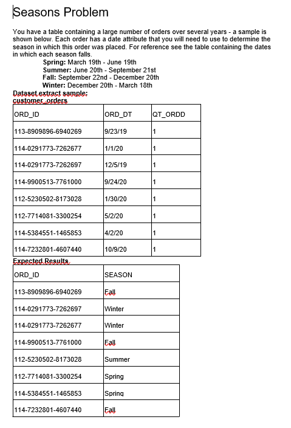

# Luis Ricardo's Code Challenge

This code was developed by **Luis Ricardo** for the given Code Challenge.

It solves three problems:

1. Customer order status


2. Seasons problem



3. Detecting change


## Installation and running

1. Clone the repository

   ```shell
   git clone git@github.com:LuissRicardo/SofttekCodeChallenge.git
   ```

2. Enter into the repository's folder:

   ```shell
   cd SofttekCodeChallenge
   ```

3. Create and activate a local virtual environment (venv):

   ```shell
   py -m venv env
   .\env\Scripts\activate
   ```

4. Install the dependencies (you must have activated the virtual environment). This may take a while.

   ```shell
   pip install -r requirements.txt
   ```

5. Run the Flask app :)

   ```shell
   py app.py
   ```

6. It's ready! Now you can use the API endpoints.

## Endpoints

You can use the following endpoints:

1. [localhost:5000/api/customer_order_status](http://localhost:5000/api/customer_order_status)
2. [localhost:5000/api/orders_by_season](http://localhost:5000/api/orders_by_season)
3. [localhost:5000/api/detecting_change](http://localhost:5000/api/detecting_change)

## Dependencies

As of now, the only (direct) dependency is [Flask](https://flask.palletsprojects.com/en/2.0.x/). When you install the
dependencies in the virtual environment, it is installed along with its dependencies.


